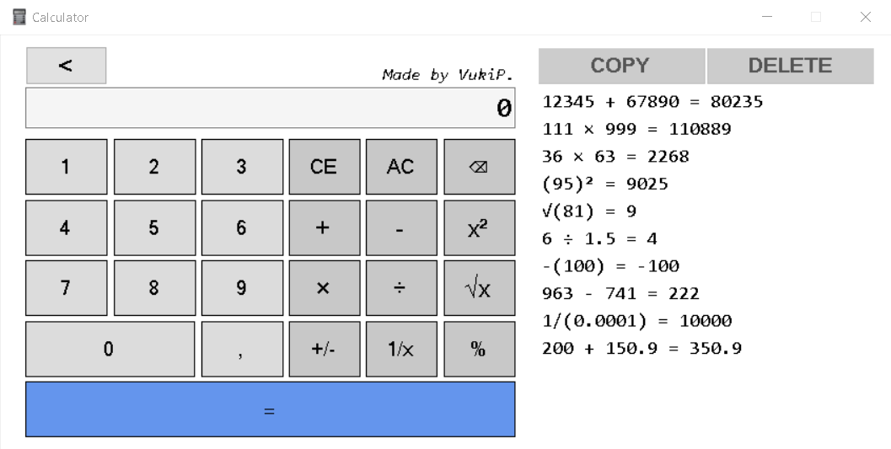

# WinForms Calculator! Wow! 

##  Preview:

## What it contains:
1. Binary operations: addition, subtraction, multiplication, division.
2. Unary operations¹: squaring, rooting, negating, reciprocal.
3. Percent based on the current calculation state.
4. Sequential calculation(no operator precedence, operations are performed in the order entered).
5. AC, CE and Backspace buttons, good when you make a mistake and want to revert it.
6. Error handling for:
  - Dividing by zero.
  - Rooting negative numbers.
  - Overflowing.
7. Polished interface.

¹Unary operations compute immediately on click.

## DOWNLOAD AND INSTALL:
Every new version of my Calculator will be published in the 'Releases' tab.

## LICENSE:
This project is licensed under the GNU General Public License v3.0.

## OWNER:
This project was built and is maintained by @VukiP.
